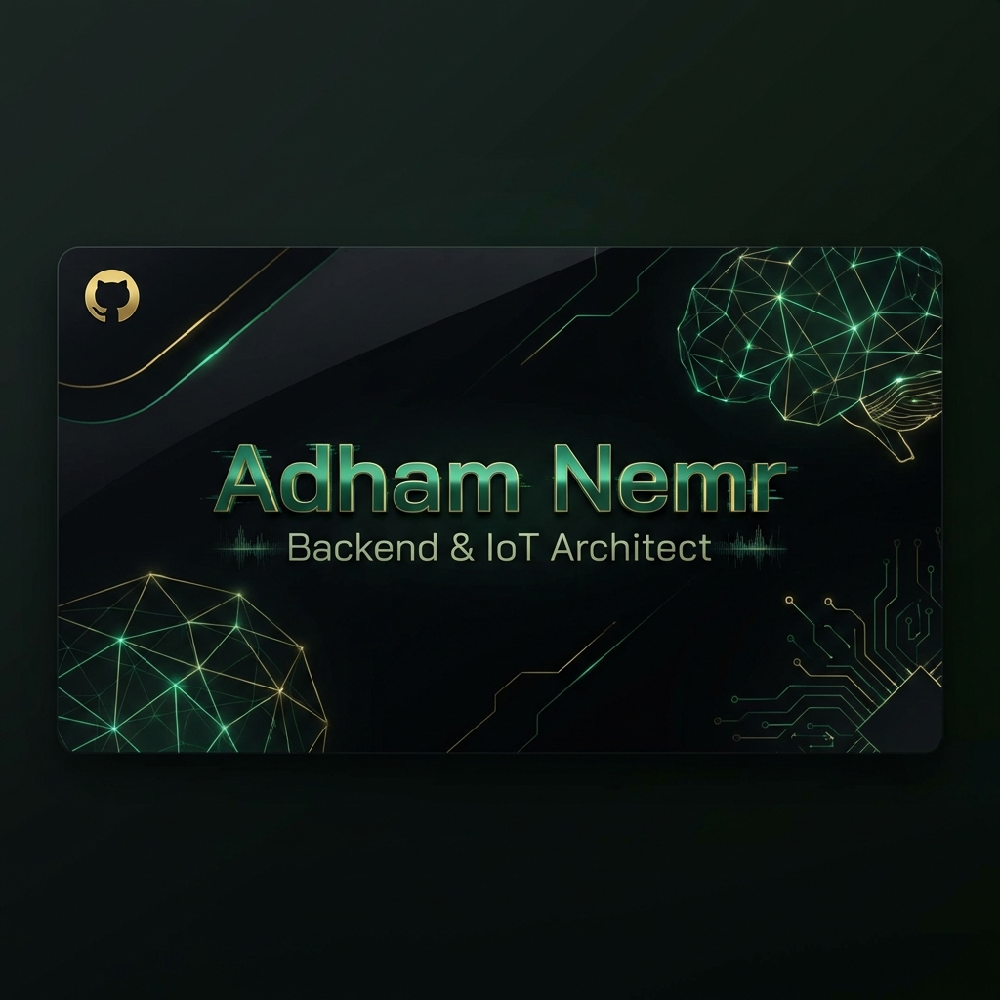

  
  
  <h1>🌌 Adham Nemr</h1>
  
<strong>Backend & IoT Architect | Full-Stack Engineer | Problem Solver</strong>

  

    
    
    
  

---

### 🚀 About Me

I am a highly driven **Software Engineer** specializing in building robust **Backend Architectures** and **IoT Ecosystems**. My passion lies in engineering high-performance systems that bridge the gap between physical hardware and digital intelligence. Currently, I am focused on developing scalable POS systems and smart automation environments.

- 🏗️ **Current Project:** Scaling the **T1T System**—a high-end POS solution for businesses.
- 📡 **Expertise:** Real-time data synchronization, IoT firmware, and secure backend APIs.
- ⚡ **Philosophy:** "Code is poetry, but performance is the rhythm."

---

### 🛠️ The Technical Arsenal

| Category | technologies |
| :--- | :--- |
| **Backend & APIs** | Node.js, Express, Supabase (PostgreSQL), RESTful APIs |
| **Frontend & UI** | React.js, Vite, Framer Motion, Vanilla CSS (Kinetic UI) |
| **Desktop & Hardware** | Electron.js, IoT Integration, Firmware Logic |
| **DevOps & Tools** | Git, Vercel, Netlify, Docker (Learning) |

---

### 🌟 Featured Orchestrations

#### 💎 [T1T Pro POS System](https://t1t-cafe-system.vercel.app)
A high-performance Desktop & Web POS system engineered for retail excellence.
- **Tech:** React, Electron, Supabase (Real-time).
- **Key Feature:** High-speed fiscal cycle management and daily/monthly reporting.

#### 🏠 [MySmartHome IoT](https://github.com/adhamNemr/MySmartHome)
A complete IoT ecosystem for residential automation and control.
- **Tech:** Node.js, IoT Sensors, Real-time Dashboard.
- **Key Feature:** Precise hardware feedback and magnetic UI controls.

#### 🛒 [Bazzez Marketplace](https://github.com/adhamNemr/Bazzez_Project)
A full-scale e-commerce marketplace with professional seller dashboards.
- **Tech:** React, Node.js, Express, MongoDB.

---

### 📊 Digital Footprint

  
  

  

---

  
<i>"Engineering the future, one commit at a time."</i>

  
✨ Built with surgical precision by Adham Nemr

